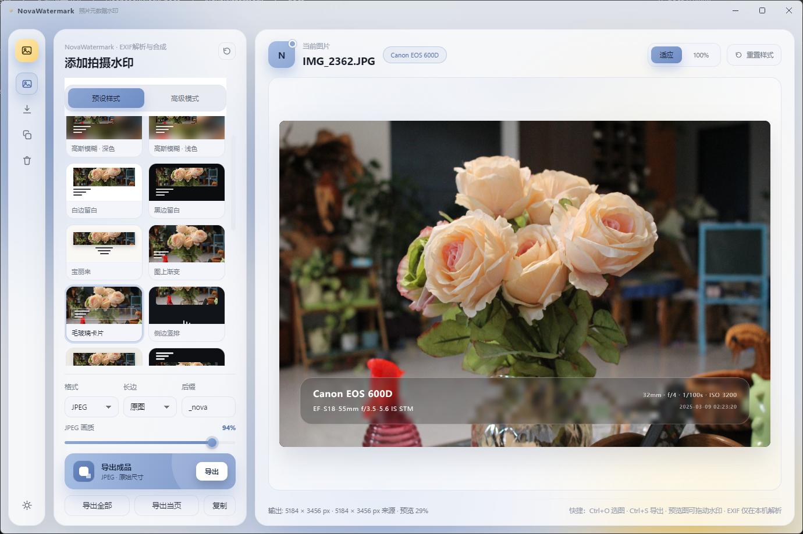
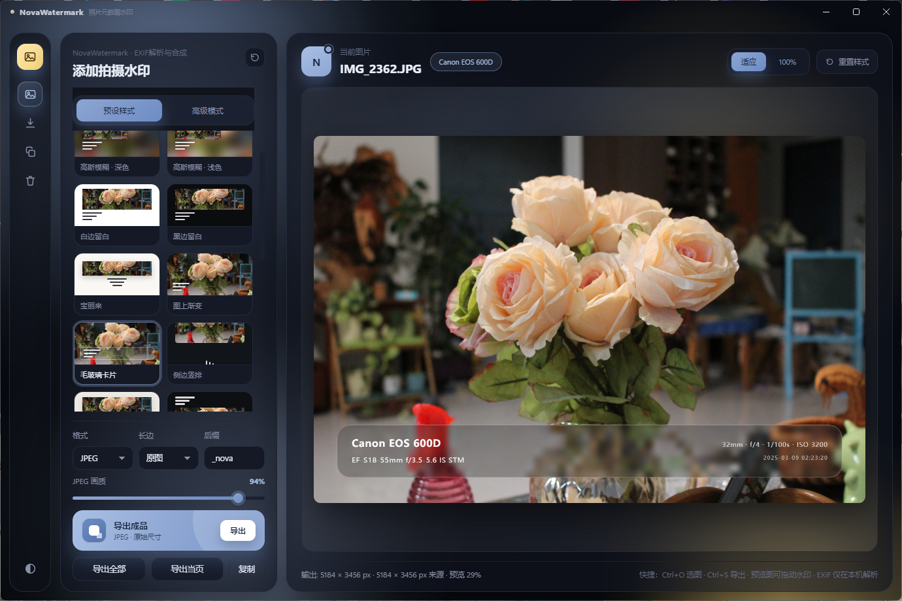

# NovaWatermark · 照片元数据水印

为照片加上「机型 / 镜头 / 拍摄参数 / 时间」等元数据水印的小工具。





三栏卡片式布局：左侧图标工具栏、中间控制面板、右侧预览区

## 功能

- **自动读取 EXIF**
- **机型美化**
- **10 种预设样式**
- **批量处理**
- **厂商 Logo（默认关闭）**
- **导出保留源照片 EXIF**
- **文字颜色自动对比**
- **动态流体背景零开销**

## 使用方式

### 1. 下载已构建程序
在Releases页面下载最新安装包或unpack程序包，按引导完成安装即可

### 2. html浏览器使用
clone源码到本地，运行index.html文件即可

### 3. 本地静态服务（可选）
```bash
npx serve .          # 或 python -m http.server 8080
```

## 预设样式

| 预设 | 效果 |
| --- | --- |
| 高斯模糊 · 深色 | 图片放在自身高斯模糊背景上（叠加图片主题色），圆角 + 阴影，下方显示水印 |
| 高斯模糊 · 浅色 | 同上，但提亮背景，适合明亮照片 |
| 白边留白 | 图片下方加白色边框显示水印（经典白边） |
| 黑边留白 | 图片下方加黑色边框显示水印 |
| 宝丽来 | 拍立得相纸：白色宽底边 + 手写字体居中 |
| 图上渐变 | 不加边框，图片原尺寸，底部渐变遮罩 + 白字 |
| 毛玻璃卡片 | 图上叠加半透明毛玻璃卡片，左右两栏排版 |
| 侧边竖排 | 侧边窄条 + 竖排文字，适合竖幅人像 |
| 画廊卡纸 | 四周宽留白的展示卡纸，衬线字体居中注释 |
| 顶部信息条 | 图片上方黑色信息条，左右两栏 |

## 编辑模式

「**预设样式**」标签页面向日常使用

| 控件 | 作用 |
| --- | --- |
| 水印方案 | 一键套用「机型 + 参数」「仅机型」「机型 + 镜头」「机型 + 时间」「机型 + 参数 + 备注」 |
| 每行开关 | 打开就显示这一行的拍摄信息：**机型**（`{Make} {Model}`）、**镜头**（`{Lens}`）、**拍摄参数**（`{Focal} · {Aperture} · {Shutter} · {ISO}`）、**时间**（`{Date} {Time}`）；关掉则这一行不显示 |
| 每行文本框 | 这一行还可以再补一句自己的话，会和开关带出的信息拼在同一行；关掉开关、只留文字，就是纯自定义的一行 |

取不到的EXIF信息会自动省略，开关和文字都会记录在本地。想精确到每个变量时，请切到「高级模式」的「水印内容（逐行 + 变量）」。

「**高级模式**」标签页把其余全部参数收在一起，适合精调：

| 分组 | 内容 |
| --- | --- |
| 版式与位置 | 版式（模糊背景 / 留白边 / 图上叠加 / 侧边竖排）、水印方位、对齐、排版、边距、圆角、阴影、描边 |
| 背景 | 背景类型（模糊 / 纯色 / 渐变）、背景色、模糊强度、亮度、主题色叠加、暗角 |
| 水印内容（逐行 + 变量） | 4 行输入框 + 可用变量面板，点击变量插入到上一次编辑的那一行 |
| 厂商 Logo | 开关（**默认关闭**）、Logo 大小，以及当前机型的识别结果 |
| 字体与配色 | 字体、字号、行距、字重、大小写、颜色模式 / 颜色 |

两个标签页共用同一份水印内容：在「预设样式」里开关、写文字，会同步到「高级模式」；

## 厂商 Logo

**默认关闭**，需要在「高级模式 → 厂商 Logo」里手动开启，并可调整 Logo 相对字号的大小。
**只在「毛玻璃卡片」和「顶部信息条」两种版式下绘制**，其余版式（模糊背景、留白边、图上渐变、侧边竖排、画廊卡纸等）不显示。

Logo 素材存放在 `image/`（来自 Wikimedia Commons / Simple Icons 的官方标识）
应用运行时用的是 **base64 data URI**，由 `tools/build-logos.mjs` 生成到 `js/logo-data.js`：

```bash
node tools/build-logos.mjs    # 改了 image/ 里的素材后重新生成
```

## 变量占位符

| 变量 | 含义 | 变量 | 含义 |
| --- | --- | --- | --- |
| `{Make}` | 厂商 | `{Shutter}` | 快门（1/200s） |
| `{Model}` | 机型（已美化） | `{ISO}` | 感光度 |
| `{ModelRaw}` | 机型原始值 | `{EV}` | 曝光补偿 |
| `{Camera}` | 厂商 + 机型 | `{Date}` | 日期 2024-05-01 |
| `{Lens}` | 镜头型号 | `{DateDot}` | 日期 2024.05.01 |
| `{Focal}` | 焦距 | `{Time}` | 时间 10:20:30 |
| `{FocalEq}` | 35mm 等效焦距 | `{DateTime}` | 日期 + 时间 |
| `{Aperture}` | 光圈 f/2.8 | `{GPS}` | GPS 坐标 |
| `{MP}` | 像素（24MP） | `{Width}` / `{Height}` | 尺寸 |
| `{File}` / `{Name}` | 文件名 | `{Software}` `{Artist}` `{Copyright}` | 软件 / 作者 / 版权 |
| `{Note}` | 自定义备注 | | |

模板里用 `·` 或 `|` 分隔，取不到数据的变量会自动省略（不会留下多余的分隔符）

## 快捷键

| 快捷键 | 作用 |
| --- | --- |
| `Ctrl/Cmd + O` | 选择图片 |
| `Ctrl/Cmd + V` | 粘贴图片（截图后直接粘贴即可） |
| `Ctrl/Cmd + S` | 导出当前图片 |
| 拖动预览图 | 移动水印位置 |
| 双击预览图 | 水印位置复位 |

## 已知问题

- 只能处理浏览器能解码的格式（JPEG / PNG / WebP / AVIF / GIF）。**HEIC / HEIF、CMYK JPEG 无法解码**，请先转回普通 JPEG
- EXIF 读取支持 JPEG(APP1)、PNG(eXIf)、WebP(EXIF)；ARW / CR3 / NEF 等 RAW 需先导出 JPEG
- EXIF 写回支持导出为 JPEG（APP1）与 PNG（eXIf）；其他导出格式只保留画面、不携带 EXIF
- 没有 EXIF 的图片（截图、社交平台导出的图）会自动回退显示文件名，并在缩略图上标记「无EXIF」
- 用「原图尺寸」导出 6000×4000 这类大图会占用较多内存（一次约 100MB），建议选择 4096 长边

## 目录结构

```
index.html          页面结构（图标栏 + 控制面板〔预设样式 / 高级模式〕+ 预览区）
css/styles.css      界面样式（亮暗双主题变量、流体背景、三栏玻璃卡片布局）
js/exif.js          轻量 EXIF 解析 / 文本格式化 / EXIF 写回（无依赖）
js/presets.js       预设样式与默认配置
js/logos.js         机型 → 厂商 Logo 匹配规则、联动品牌、按需加载
js/logo-data.js     自动生成：Logo 的 base64 素材 + 亮度 / 饱和度统计
js/render.js        Canvas 渲染引擎（版式、模糊背景、水印排版、Logo 绘制）
js/app.js           交互逻辑（载入、预览、拖拽、导出）
image/              Logo 源素材（88 个 PNG，只作来源，运行时不直接引用）
tools/build-logos.mjs  由 image/ 生成 js/logo-data.js
electron/main.cjs   Electron 主进程（本地静态服务 + 窗口）
electron/preload.cjs Electron 预加载脚本（接管导出下载，弹原生「另存为」并写盘）
docs/screenshot.png 界面截图（亮 / 暗各一张）
```
